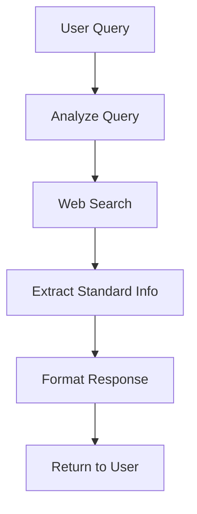

# ISO Medical Device Standards Agent

An intelligent chatbot built with LangGraph and OpenAI that provides information about ISO medical device standards. The agent uses a multi-step workflow to analyze queries, search for information, and provide structured responses about medical device standards.

## Features

- **Query Analysis**: Intelligently analyzes user queries to identify specific ISO standards or device categories
- **Web Search Integration**: Generates targeted search queries for current standard information
- **Standards Database**: Built-in database of key medical device ISO standards
- **Structured Responses**: Provides formatted information including scope, application, and publication dates
- **Conversation History**: Maintains context across multiple interactions
- **Command-line Interface**: Interactive chat interface for easy use

## Supported Standards

- **ISO 13485**: Quality Management Systems for Medical Devices
- **ISO 14971**: Risk Management for Medical Devices  
- **IEC 62304**: Medical Device Software - Software Life Cycle Processes

## Prerequisites

- Python 3.8+
- OpenAI API key
- Internet connection for web search functionality

## Installation

1. **Clone the repository**
   ```bash
   git clone <repository-url>
   ```

2. **Install dependencies**
   ```bash
   pip install langgraph langchain-openai python-dotenv requests
   ```

3. **Set up environment variables**
   Create a `.env` file in the project root:
   ```
   OPENAI_API_KEY=your_openai_api_key_here
   ```

## Usage

### Command Line Interface

```bash
python iso_medical_standard_agent.py
```

### Programmatic Usage

```python
from iso_medical_standard_agent import ISOMedicalStandardAgent

# Initialize agent
agent = ISOMedicalStandardAgent("your_openai_api_key")

# Ask a question
response = agent.chat("What is ISO 13485?")
print(response)

# Continue conversation with history
history = [{"user": "What is ISO 13485?", "bot": response}]
response2 = agent.chat("What about ISO 14971?", history)
```

## Workflow Architecture



### Workflow Steps

1. **Query Analysis**: Determines if query is about specific standards, device categories, or general inquiries
2. **Web Search**: Generates and executes search queries for current information
3. **Standard Extraction**: Combines database information with search results
4. **Response Formatting**: Structures information in a consistent, readable format

## Example Queries

- "What is ISO 13485?"
- "Tell me about risk management standards for medical devices"
- "What standards apply to medical device software?"
- "I need information about quality management for medical devices"

## Response Format

The agent provides structured responses including:

- **Standard Number and Title**
- **Topic**: Main subject area
- **Scope**: Coverage and boundaries
- **Product Application**: Applicable devices/products
- **Publication Date**: When published/updated
- **Summary**: Brief description

## Configuration

### Model Settings
- **Model**: GPT-4.1-mini
- **Temperature**: 0.1 (for consistent responses)
- **Separate LLMs**: Main processing and search query generation

### Memory Management
- Maintains last 5 conversation exchanges
- Automatic history pruning to manage memory

## File Structure

```
Agent_Langgraph_Learning/
├── iso_medical_standard_agent.py    # Main application
├── README_iso_medical.md            # This file
└── .env                            # Environment variables
```

## Dependencies

- `langgraph`: Workflow orchestration
- `langchain-openai`: OpenAI integration
- `python-dotenv`: Environment management
- `requests`: HTTP requests for web search

## API Usage

The agent uses OpenAI's GPT-4.1-mini model for:
- Query analysis and understanding
- Information extraction and processing
- Response formatting and structuring
- Search query generation

## Limitations

- Web search is currently simulated (placeholder implementation)
- Database contains limited set of standards
- Requires OpenAI API key and credits
- Information accuracy depends on training data cutoff

## Future Enhancements

- Real web search API integration
- Expanded standards database
- Support for additional medical device standards
- Export functionality for responses
- Integration with official ISO databases

## Troubleshooting

**API Key Issues**
- Ensure OPENAI_API_KEY is set in environment variables
- Verify API key has sufficient credits

**Import Errors**
- Install all required dependencies: `pip install -r requirements.txt`
- Check Python version compatibility

**Response Quality**
- Lower temperature for more consistent responses
- Adjust system prompts for specific use cases

## License

MIT License
